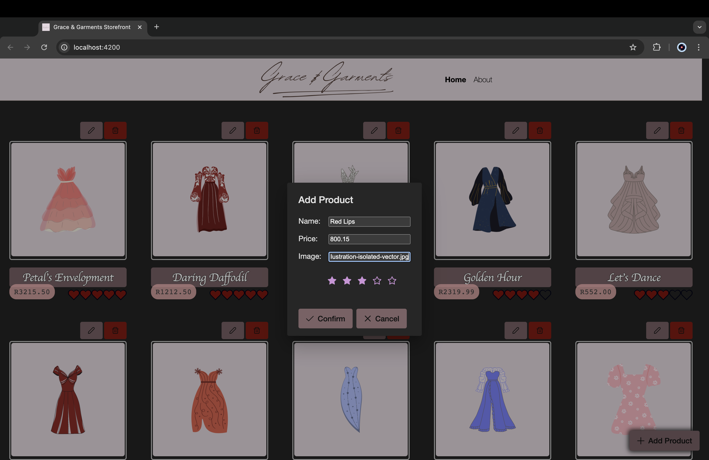
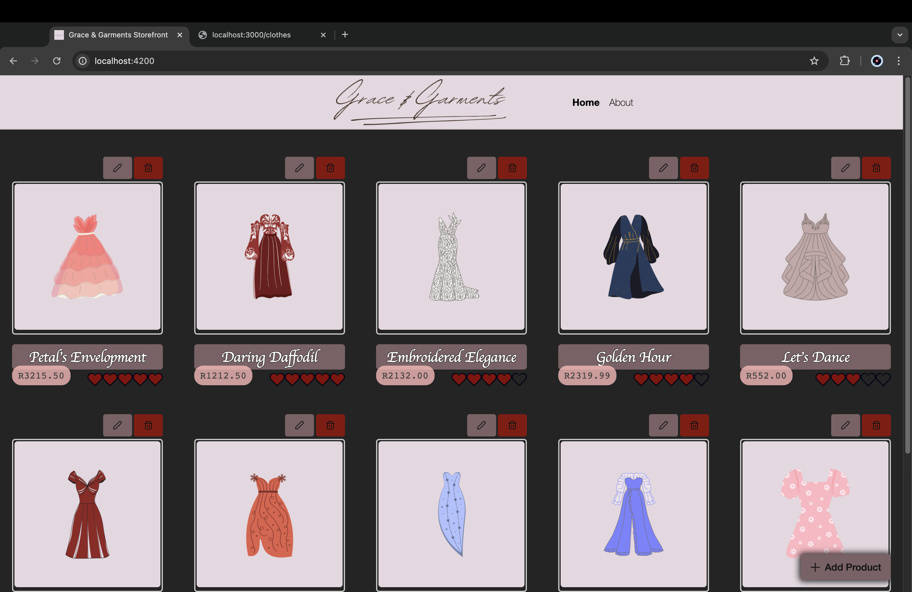
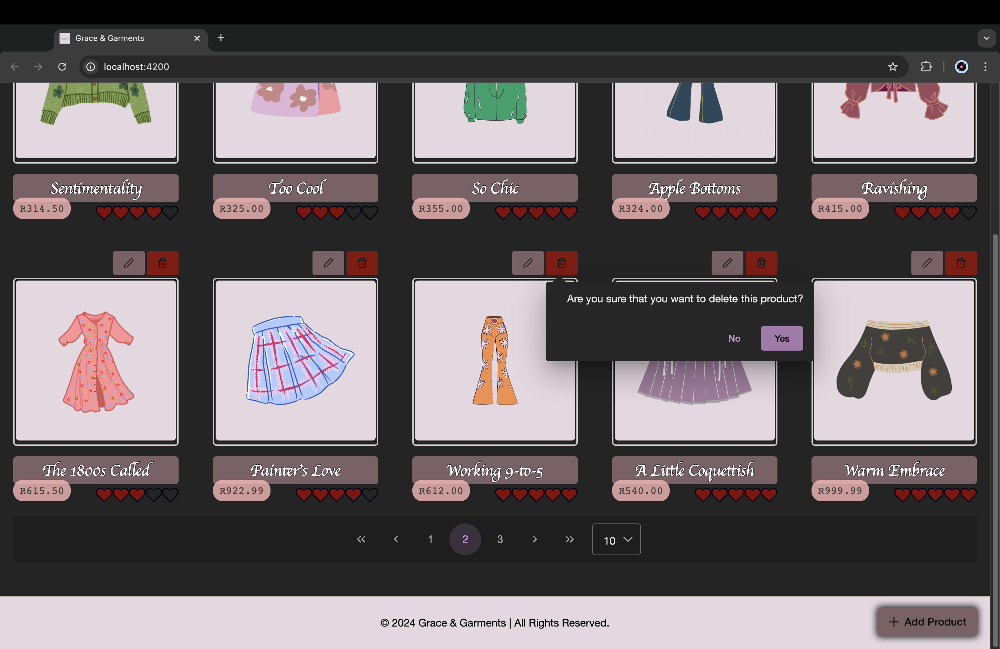
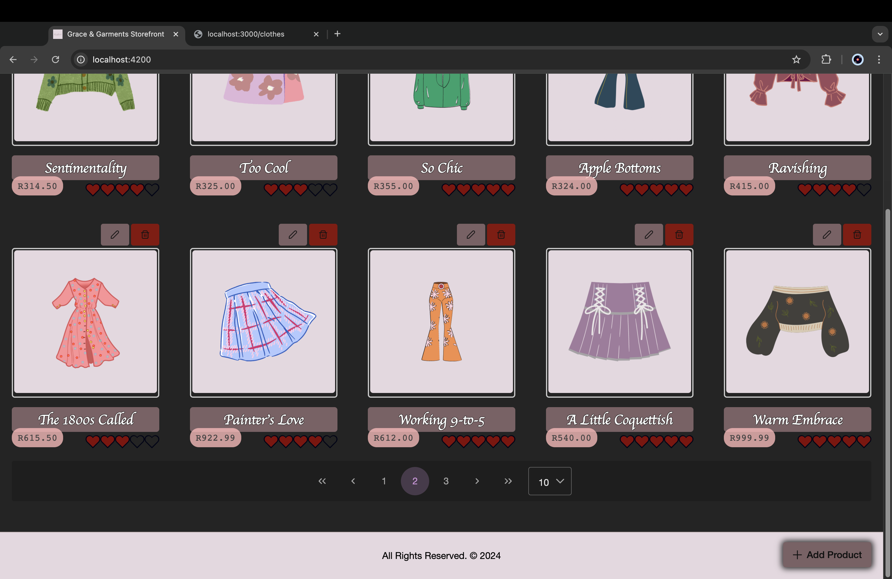
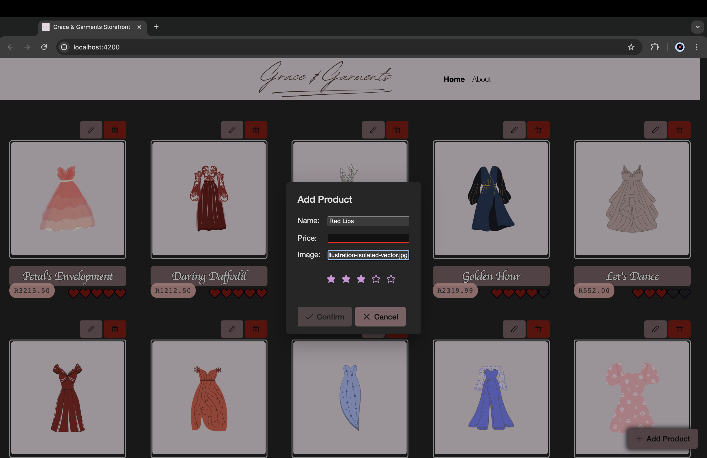
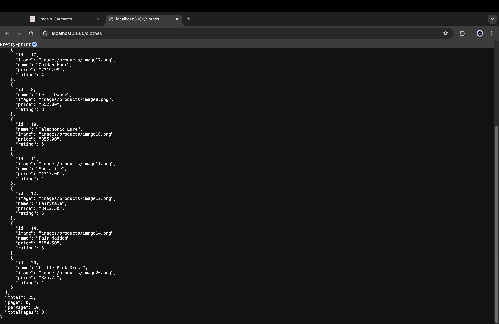

# Grace & Garments - Full Stack Application

**Grace & Garments** is a stylish online storefront, featuring a **frontend** built with **Angular** and a **backend** powered by **Node.js** and **Express.js**. Users can perform full CRUD (Create, Read, Update, Delete) operations on product data, showcasing unique outfits customised in [**Canva**](canva.com).

## Table of Contents

- [Overview](#overview)
- [Features](#features)
- [Screenshots](#screenshots)
- [Frontend](#frontend)
- [Backend](#backend)
- [Configuration](#configuration)

## Overview

The application allows users to browse, add, update and delete products, ensuring smooth product management through seamless interaction between the frontend and backend.

## Features

- **Frontend:**

  - Standalone Angular application with routing and services
  - CRUD operations for product management
  - Customised product images

- **Backend:**
  - Express.js server with RESTful API
  - JSON data storage for simplicity

## Screenshots

Here are some screenshots of the project in action:

- **Homepage:**
  

- **About Us Page:**
  

- **Add Product:**
  

- **Update Product:**
  

- **Updated Product:**
  

- **Delete Product:**
  

- **Pagination:**
  

- **Popup Validation:**
  

- **RESTful API:**
  

## Frontend

### Frontend: Prerequisites

- [Node.js](https://nodejs.org/) and [npm](https://www.npmjs.com/)
- Angular CLI:

  ```zsh
  npm install -g @angular/cli
  ```

### Frontend: Installation

1. Clone the repository:

   ```zsh
   git clone https://github.com/jediahjireh/product-management-system.git
   ```

2. Navigate to the frontend directory:

   ```zsh
   cd product-management-system/storefront
   ```

3. Install dependencies:

   ```zsh
   npm install
   ```

### Frontend: Usage

1. Start the development server:

   ```zsh
   ng serve
   ```

2. Open [http://localhost:4200/](http://localhost:4200/) in your browser.

## Backend

### Backend: Prerequisites

- [Node.js](https://nodejs.org/) and [npm](https://www.npmjs.com/)

### Backend: Installation

1. Clone the repository:

   ```zsh
   git clone https://github.com/jediahjireh/product-management-system.git
   ```

2. Navigate to the backend directory:

   ```zsh
   cd product-management-system/backend
   ```

3. Install dependencies:

   ```zsh
   npm install
   ```

### Backend: Usage

1. Start the server:

   ```zsh
   npm start
   ```

2. Access the server at [http://localhost:3000/](http://localhost:3000/).

## Backend: JSON Structure

Product data is managed using the following JSON structure in [`products.json`](/backend/products.json):

```json
{
  "products": [
    {
      "id": 1,
      "name": "Sample Product",
      "image": "images/products/sample.png",
      "price": "99.99",
      "rating": 4
    }
  ]
}
```

## Configuration

Replace live website links with localhost endpoints in development.

```javascript
// cors configuration - allow requests from frontend (https://localhost:4200)
const corsOptions = {
  origin: "https://localhost:4200",
  optionsSuccessStatus: 204,
  methods: "GET, POST, PUT, DELETE",
};
```

- Backend: [server.js](/backend/server.js) (replace link to frontend)

```typescript
 fetchProducts(page: number, perPage: number) {
    this.productsService
      // fetch products from frontend (http://localhost:3000/clothes)
      .getProducts('http://localhost:3000/clothes', {
        page,
        perPage,
      })
      .subscribe({
        next: (products: Products) => {
          // loop through array
          this.products = products.products;
          this.totalRecords = products.total;
        },
        error: (error) => {
          console.log(error);
        },
      });
  }

 // CRUD functions
  editProduct(product: Product, id: number) {
    this.productsService
      .editProduct(`http://localhost:3000/clothes/${id}`, product)
      .subscribe(
        {
          next: (data) => {
            console.log(data);
          },
          error: (error) => {
            console.log(error);
          },
        }
      );
  }

  deleteProduct(id: number) {
    this.productsService
      .deleteProduct(`http://localhost:3000/clothes/${id}`)
      .subscribe({
        next: (data) => {
          console.log(data);
          this.fetchProducts(0, this.rows);
          this.resetPaginator();
        },
        error: (error) => {
          console.log(error);
        },
      });
  }

  addProduct(product: Product) {
    this.productsService
      .addProduct(`http://localhost:3000/clothes`, product)
      .subscribe({
        next: (data) => {
          console.log(data);
          this.fetchProducts(0, this.rows);
          this.resetPaginator();
        },
        error: (error) => {
          console.log(error);
        },
      });
  }
```

- Frontend: [home.component.ts](/storefront/src/app/home/home.component.ts) (replace links to backend API)

---
